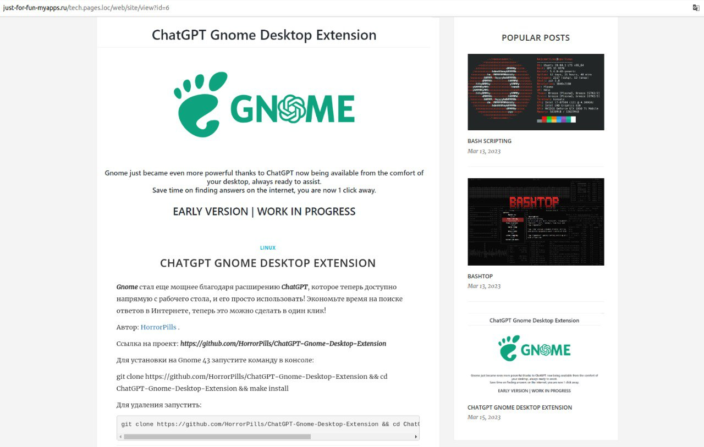

IT Articles Blog:
--------------------
Важное обновление!
Я развернула тестовую версию сайта на своем домене - [ссылка](http://techpages.website/tp/web/)!
---------------------
I use:
* Yii v 2.0.10
* MySQL v 5.5
* Apache 2.4
* PHP 7.2
* Phantom.js - headless browser for test screens
* Postman for testing
* Extension [CKeditor](https://github.com/MihailDev/yii2-ckeditor) 
* Extension [elfinder](https://github.com/MihailDev/yii2-elfinder)

It looks like this for now (Test articles, test pictures)

