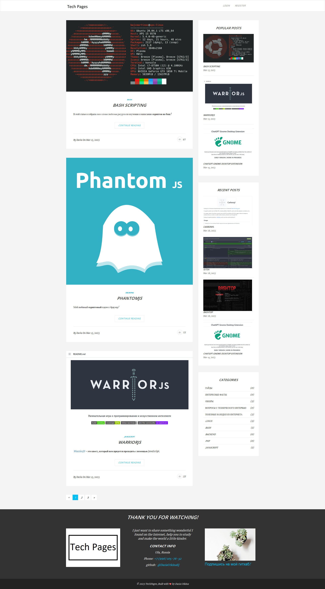

IT Articles Blog:
--------------------
I use:
* Yii v 2.0.10
* MySQL v 5.5
* Apache 2.4
* PHP 7.2
* Phantom.js - headless browser for test screens
* Postman for testing
* Extension [CKeditor](https://github.com/MihailDev/yii2-ckeditor) 
* Extension [elюfinder](https://github.com/MihailDev/yii2-elfinder)

It look like this for now (Test articles, test pictures)

here's login page:

text editor for articles:

